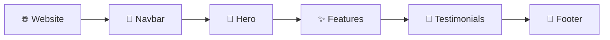

# 🎓 IELTS Institute — React Internship Assignment

<p align="center">
  <strong>A modern, responsive IELTS institute landing page built with React.</strong><br/>
  Clean UI • Responsive Design • Component-Based Architecture
</p>

<p align="center">
  
  
  
  
</p>

---

## 🎬 Preview

<p align="center">

<a href="YOUR_VIDEO_LINK">
  
</a>

</p>

<p align="center">
  
</p>

---

## ✨ Features

```text
🏠 Responsive Landing Page
🧭 Navigation Bar
🚀 Hero Section
⭐ Features Section
💬 Testimonials
📱 Mobile-Friendly UI
🎨 Tailwind Styling
⚡ Component-Based React
🧪 Jest Testing
♿ Clean Accessible Structure
```

---

## 🔄 Page Flow



---

## 🏗️ Architecture

```text
                ┌────────────────────┐
                │     React App      │
                └─────────┬──────────┘
                          │
              ┌───────────┼───────────┐
              ▼           ▼           ▼
           Navbar       Hero       Features
                                      │
                                      ▼
                                Testimonials
                                      │
                                      ▼
                                   Footer
```

---

## 🧩 Component Flow

```text
App
 │
 ├── Navbar
 ├── Hero
 ├── Features
 ├── Testimonials
 └── Footer
```

---

## 🛠️ Tech Stack

| Technology | Purpose |
|---|---|
| **React 19** | UI development |
| **JavaScript** | Application logic |
| **Tailwind CSS** | Styling |
| **Lucide React** | Icons |
| **Jest** | Testing |
| **React Testing Library** | Component testing |
| **Create React App** | Development & build tooling |

---

## 📁 Project Structure

```text
IELTS-Institute-Internship-Assignment/
├── public/
├── src/
│   ├── components/
│   ├── App.js
│   ├── App.css
│   ├── App.test.js
│   ├── index.css
│   └── index.js
├── package.json
└── README.md
```

---

## 🚀 Run Locally

```bash
git clone https://github.com/AkshatRaj00/IELTS-Institute-Internship-Assignment.git

cd IELTS-Institute-Internship-Assignment

npm install

npm start
```

Open:

```text
http://localhost:3000
```

### 🧪 Run Tests

```bash
npm test
```

### 📦 Production Build

```bash
npm run build
```

---

## 🎯 Assignment Focus

```text
Design
  ↓
React Components
  ↓
Responsive Layout
  ↓
Tailwind Styling
  ↓
Testing
  ↓
Production Build
```

---

<p align="center">

### 🎓 IELTS Institute

<strong>Learn Better. Speak Better. Achieve More.</strong>

<br/><br/>

Built by <b>Akshat Raj</b>

</p>
